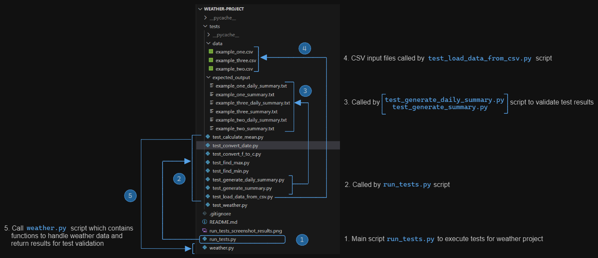

# Weather Project

## Overview 

- **run_tests.py** carries out **8 unit tests** calling functions within the **weather.py** script

## Screenshots of run_tests.py 

- Screenshot of unit test being run and successful results

## High Level Flow of Project

- A high level flow of the scripts and how they are called in the weather project is provided in the screenshot
- The **run_tests.py** script is the main script to be executed to run the weather data tests
- The **weather.py** script contains the functions that contain the core logic for handling weather data input and returning results

## Details of Unit Tests

- A summary of each unit test is provided below
- Each test calls a separate script that contains the expected test data result to compare against the results returned from the function called in the **weather.py** script except for **GenerateSummaryTests** and **GenerateDailySummaryTests**. These compare the results returned by **weather.py** script against separate results files.
- 1 function is supplied in **weather.py** script to format a string with degrees celcius symbols

### ConvertDateTests 
 No. Tests | Function Called | From Script | Arguments | Return
| :---: | :---: | :---: | :--- | :--- 
4 | convert_date | weather.py | Provide an iso date format | Formatted as Weekday Date Month Year

### ConvertTempTests 
 No. Tests | Function Called | From Script | Arguments | Return
| :---: | :---: | :---: | :--- | :--- 
4 | convert_f_to_c | weather.py | Provide a temperature in fahrenheit | Temperature in degrees celcius, rounded to 1 decimal place

### CalculateMeanTests 
 No. Tests | Function Called | From Script | Arguments | Return
| :---: | :---: | :---: | :--- | :--- 
4 | calculate_mean | weather.py | Provide list of temperatures | The mean temperature as a float

### LoadCSVTests
 No. Tests | Function Called | From Script | Arguments | Return
| :---: | :---: | :---: | :--- | :--- 
1 | load_data_from_csv | weather.py | Provide the file path to a csv file | List of lists for non-empty lines in the csv file 

### FindMinTests
 No. Tests | Function Called | From Script | Arguments | Return
| :---: | :---: | :---: | :--- | :--- 
6 | find_min | weather.py | Provide a list of temperatures | Lowest minimim value and it's last position in the list if there is more than one occurrence 

### FindMaxTests
 No. Tests | Function Called | From Script | Arguments | Return
| :---: | :---: | :---: | :--- | :--- 
6 | find_max | weather.py | Provide a list of temperatures | Highest maximum value and it's last position in the list if there is more than one occurrence 

### GenerateSummaryTests
 No. Tests | Function Called | From Script | Arguments | Return
| :---: | :---: | :---: | :--- | :--- 
3 | generate_summary | weather.py | Provide a list of lists for weather data | A string is returned with summary information based on the data for several days with the minimum and maximum temperature and which day this will occur on for the period. The average minimum and average maximum temperature is also returned. If there is more than one occurrence of min/max temperature, this will take the latest date to return

### GenerateDailySummaryTests
 No. Tests | Function Called | From Script | Arguments | Return
| :---: | :---: | :---: | :--- | :--- 
3 | generate_daily_summary | weather.py | Provide a list of lists for weather data | A string is returned with summary information based on the data for each day with the minimum and maximum temperature in degrees celcius

