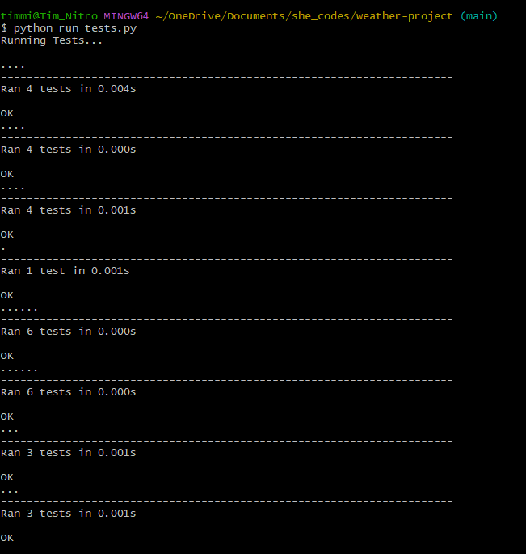

# Weather Project

## Overview 

- run_tests.py carries out 8 unit tests calling functions within the weather.py script

## Screenshots of run_tests.py 

- Screenshot of unit test being run and successful results

## Details of Unit Tests

- A summary of each unit test is provided below
- Each test calls a separate script that contains the expected test data result to compare against the results returned from the function called in the weather.py script except for GenerateSummaryTests and GenerateDailySummaryTests. These compare the results returned by weather.py script against separate results files.
- 1 function is supplied in weather.py script to format a string with degrees celcius symbols

### ConvertDateTests 
- this contains 4 tests 
- this calls function convert_date in weather.py script 
- provide an iso date format to be formatted as Weekday Date Month Year
### ConvertTempTests 
- this contains 4 tests 
- this calls function convert_f_to_c in weather.py script 
- provide a temperature in fahrenheit and return temperature in degrees celcius, rounded to 1 decimal place
### CalculateMeanTests 
- this contains 4 tests
- this calls function calculate_mean in weather.py script 
- provide a list of temperatures, return the mean temperature as a float
### LoadCSVTests
- this contains 1 test
- this calls function load_data_from_csv in weather.py script
- provide the file path to a csv file, return a list of lists for non-empty lines in the csv file 
### FindMinTests
- this contains 6 tests
- this calls function find_min in weather.py script 
- provide a list of temperatures, return the minimim value and it's position in the list
### FindMaxTests
- this contains 6 tests
- this calls function find_max in weather.py script 
- provide a list of temperatures, return the maximum value and it's position in the list
### GenerateSummaryTests
- this contains 3 tests
- this calls function generate_summary in weather.py script
- A list of lists for weather data is provided, a string is returned with summary information based on the data for several days with the minimum and maximum temperature and which day this will occur on for the period. The average minimum and average maximum temperature is also returned. If there is more than one occurrence of min/max temperature, this will take the latest date to return
### GenerateDailySummaryTests
- this contains 3 tests
- this calls function generate_daily_summary in weather.py script 
- A list of lists for weather data is provided, a string is returned with summary information based on the data for each day with the minimum and maximum temperature in degrees celcius

